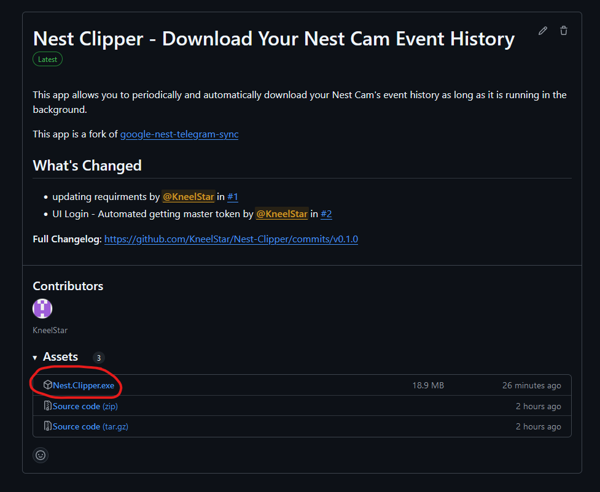
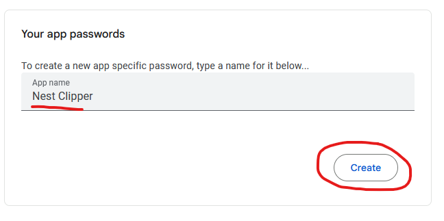
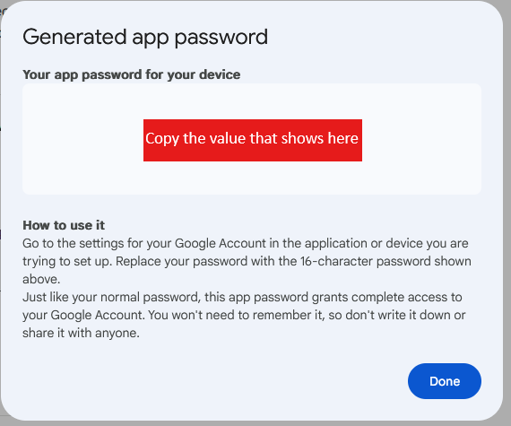
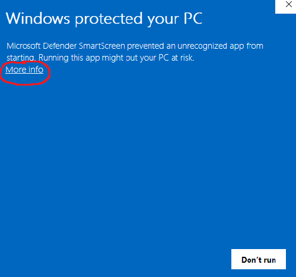
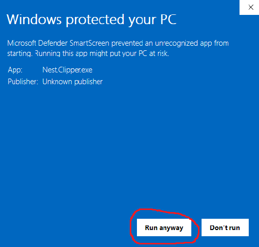
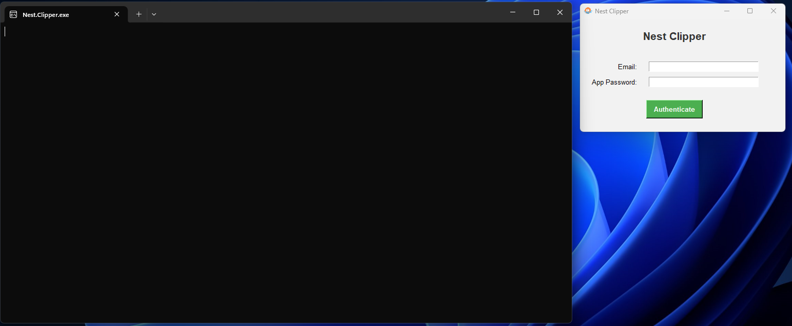
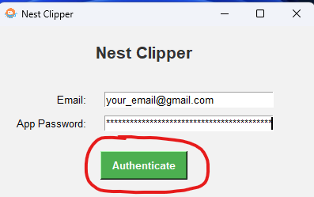
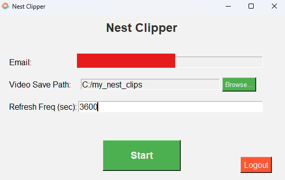

# Nest Clipper

### Easily download your Nest Cam event history for free.

[Note]: Before we proceed, please note that this project uses unpublished APIs, which may stop working if Google makes changes to how Nest event history is handled, how clips are downloaded, etc. There are several potential points of failure, but as of Dec 26, 2024, this project is functional. It is intended for personal use only. Use it at your own risk!

## Important Considerations:
  * Currently only Windows executable is published
  * Your Google account must have 2FA enabled.
  * Not all Nest cameras are supported. This app has been tested and confirmed to work with the Nest Indoor/Outdoor Battery Camera.
  * Only Nest accounts linked to a Google Account will work. Your cameras must appear in the Google Home app.
  * If your Google account does not end with "@gmail.com," this app might not work for you.

## Usage Instructions:

  #### Easy Plug-N-Play (Windows only)

  1. Download Nest.Clipper.exe from the latest [Release](https://github.com/kneelstar/Google-Nest-Clipper/releases).
  
   
   
  2. Create a new app password for your [Google account](https://myaccount.google.com/apppasswords) and copy it.
  
  
   
   
  3. Run the .exe file. (You might get a Windows warning - Click on "More info" and click "Run Anyway")
  
  

  Finally you should see two things open up:
  
   
   
  4. Enter your Nest-linked Google account email and paste the app password from step 2, then click on Authenticate.
  
  
  If the authenication is successful you should see the following window open:
  
   
   
  5. Select the folder where you want to save your clips.
  6. Specify how often the app should check for new clips. The default interval is 3600 seconds (1 hour).
  7. Click on the Start button and leave the app running in the background. 
  
  ##### BOOM! You are automatically saving your clips periodically.
  
   
   
  
  #### Running with python 3.9.2
  Please make sure you are running with python 3.9.2
  1. ``git clone https://github.com/KneelStar/Nest-Clipper.git``
  2. ``cd Nest-Clipper``
  3. ``python -m venv venv``
  4. If Win: ``venv\Scripts\activate``, If MacOs/Linux: ``source venv/bin/activate``
  5. ``pip install -r requirements.txt``
  6. ``pip install requests==2.25.1``
  6. ``python app.py``

## Credits:

A lot of the heavy lifting was done by people below. Without them, their code, their contributions, their time - this app would not have been possible. 

@TamirMa - [**google-nest-telegram-sync**](https://github.com/TamirMa/google-nest-telegram-sync) 
You can read TamirMa's full story [here](https://medium.com/@tamirmayer/google-nest-camera-internal-api-fdf9dc3ce167)

The contributors of [**gpsoauth**](https://github.com/simon-weber/gpsoauth) module

The contributors of [**glocaltokens**](https://github.com/leikoilja/glocaltokens) module

The authors of the docker [**ha-google-home_get-token**](https://hub.docker.com/r/breph/ha-google-home_get-token)

